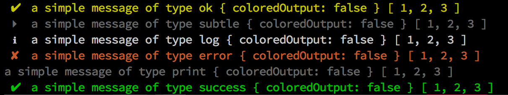

[](https://npmjs.org/package/clix-logger)
[](https://travis-ci.org/royriojas/clix-logger)

# clix-logger
Another console log wrapper with colored support and icons

## Install

```bash
npm i -g clix-logger
```

## Usage

```javascript
var options = {
  // Will print the messages using chalk colors. default is false
  coloredOutput: false,
  // Will suppress the output of `subtle` and `log` methods
  // all of the others will still be printed
  quiet: false // default is false,
};
var logger = require('clix-logger')(options);
logger.log('some', 'message', 'here');
```

## methods

- `ok(arg1[, arg2, ...argn] )`
- `subtle(arg1[, arg2, ...argn] )`
- `log(arg1[, arg2, ...argn] )`
- `success(arg1[, arg2, ...argn] )`
- `error(arg1[, arg2, ...argn] )`
- `print(arg1[, arg2, ...argn] )`

**NOTES**:

- All the methods above use `console.log` to print the messages, except the `error` one, which uses `console.error`.
- `subtle` and `log` are suppressed when `options.quiet` is specified.
- `print` does not have an icon at the beginning of the line

## Example

the following code

```javascript
var logger = require('clix-logger')({ coloredOutput: true });

# will use yellow color
logger.ok( 'a', 'simple', 'message', 'of', 'type', 'ok', {
  coloredOutput: false
}, [ 1, 2, 3 ] );

# will use white color
logger.subtle( 'a', 'simple', 'message', 'of', 'type', 'subtle', {
  coloredOutput: false
}, [ 1, 2, 3 ] );

# will use white color
logger.log( 'a', 'simple', 'message', 'of', 'type', 'log', {
  coloredOutput: false
}, [ 1, 2, 3 ] );

# will use red color
logger.error( 'a', 'simple', 'message', 'of', 'type', 'error', {
  coloredOutput: false
}, [ 1, 2, 3 ] );

# will use gray color
logger.print( 'a', 'simple', 'message', 'of', 'type', 'print', {
  coloredOutput: false
}, [ 1, 2, 3 ] );

# will use green color
logger.success( 'a', 'simple', 'message', 'of', 'type', 'success', {
  coloredOutput: false
}, [ 1, 2, 3 ] );
```

Will produce this output:



## License

[MIT](./LICENSE)

## Changelog

[Changelog](./changelog.md)
